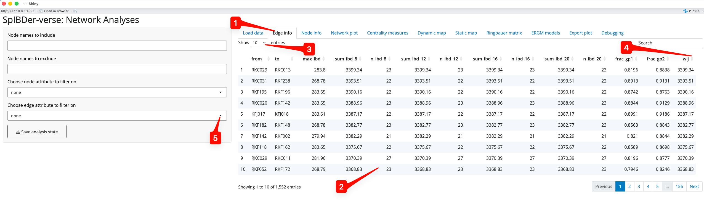
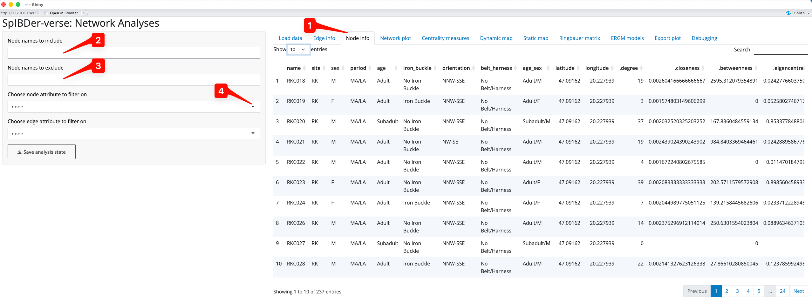
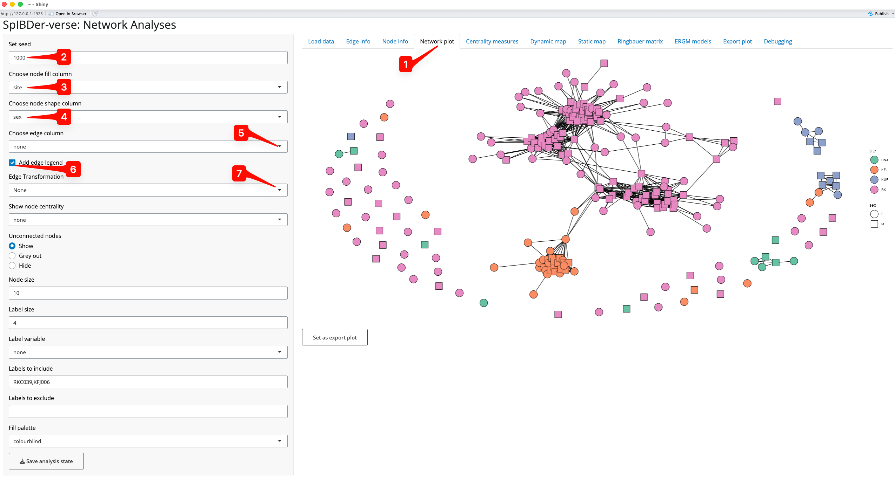
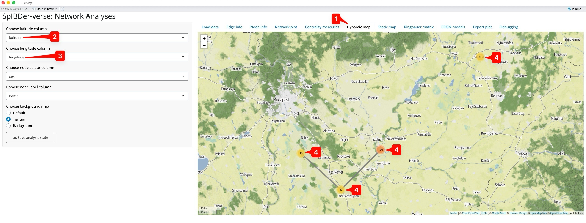
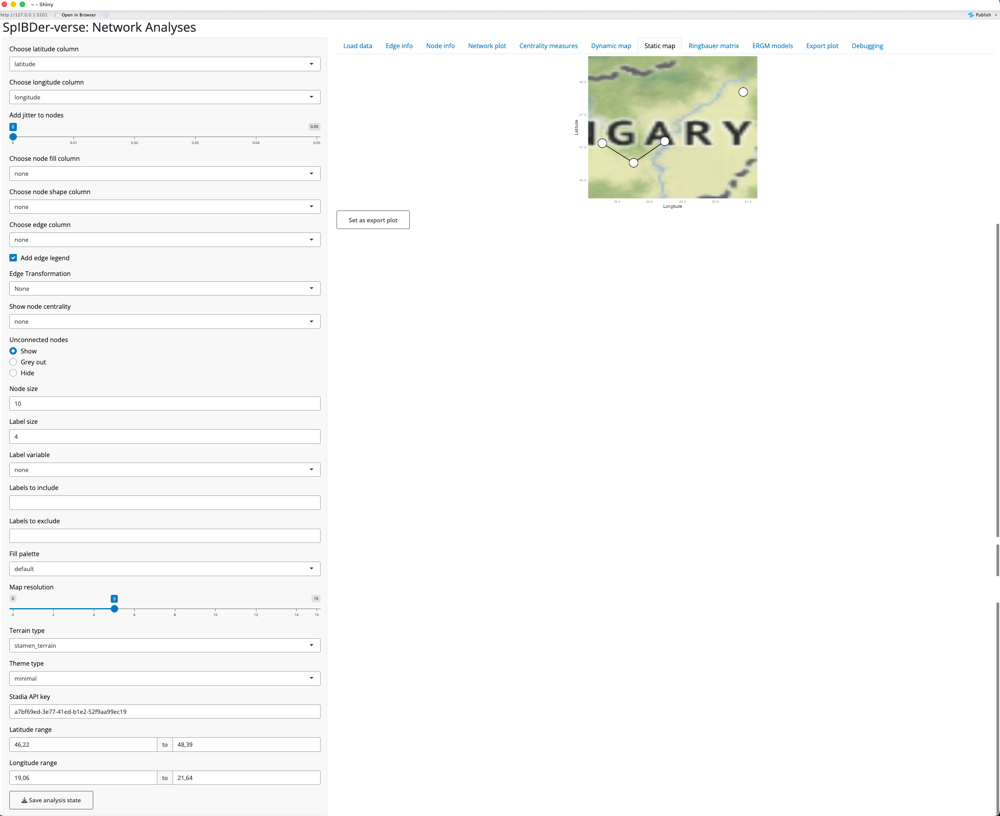
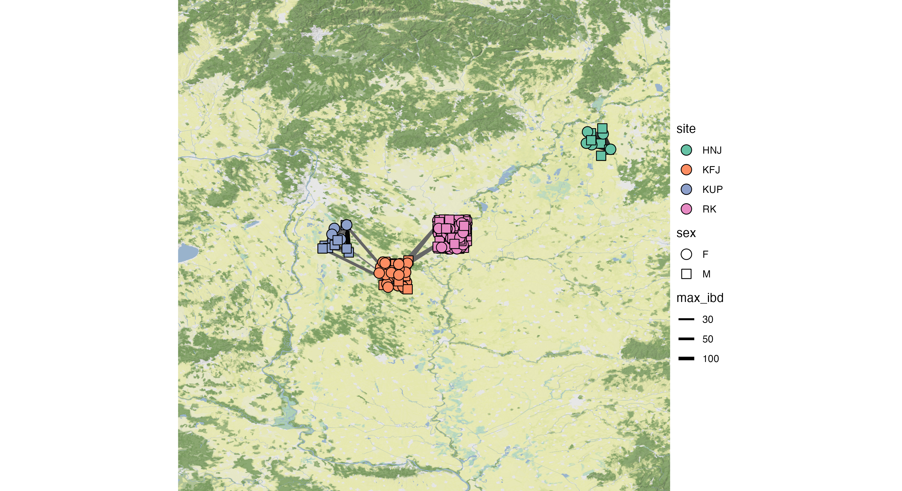
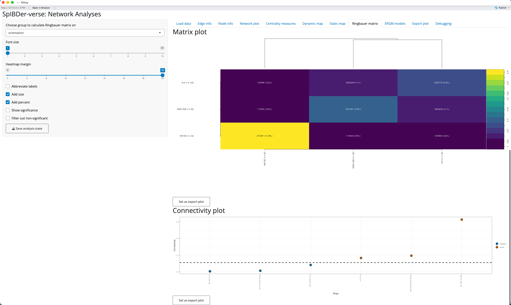
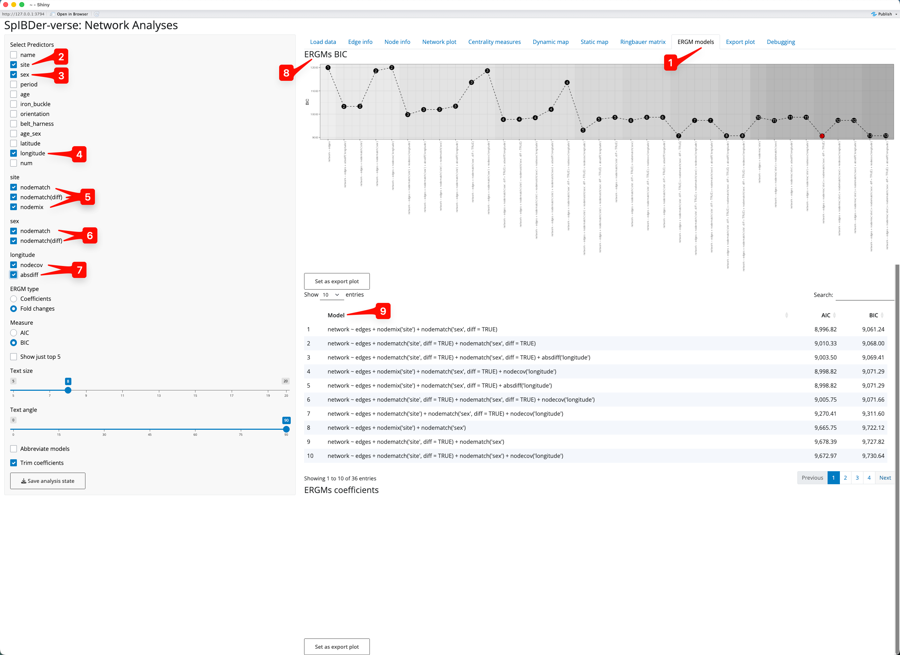
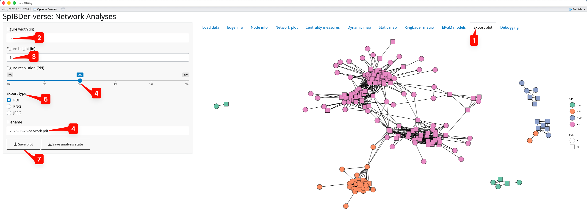

# Using the spIBDerapp

``` r

library(spIBDerverse)
```

## Introduction

The SpIBDer-verse is a collection of methods that was primarily
developed for the analysis of IBD networks, but can in principle be used
for networks of any type (this usability in development). SpIBDer-verse
can be used for three main approaches to network analysis: (i)
visualisation, (ii) data exploration and (iii) formal hypothesis
testing.

The SpIBDer-App is designed to be modular, with modules arranged into
tabs, with the exception of three tabs for loading/checking data (*Load
data*, *Edge info* and *Node info*) and one tab for exporting figures
(*Export plot*). New modules can be added in future releases of the
SpIBDer-verse as new methods are developed, or if users request new
functionality.

Any new network analysis begin with the same task: getting your data
into the app. Networks in general require two types of information: node
and edge information.

1.  **Node information:** (meta data) reflects properties of the
    individual units in your analysis: most likely sampled individuals,
    and may include variables such as their sample ID, genetic sex, age
    at death, etc. The first column in this file should contain the node
    (individual) ID, and then each row contains any meta
    data/information about the nodes that you might want to visualise or
    analyse.
2.  **Edge information:** this file contains information about the
    connections between node (individuals), and hence the first two
    column must contain the names of two nodes as found in the node
    information. This table can include numerical or categorical
    information, such as the IBD information from ancIBD, the geographic
    distance between two burials or the type of relationship if it has
    been estimated (Parent/Child, 4th-degree etc).

This is the minimum information that can be uploaded to the app to run
SpIBDer-app. We now explain how each module works, tips and tricks for
using the app and how some output can be interpreted.

## Running the app

To launch the SpIBDer-app, first load the package and then run the app
by typing into the command line in R:

``` r

require(spIBDerverse)
spibder_app()
```

## Loading data

Please note that the “Load distance data” function is currently under
development and cannot currently be used.

### Pre-loaded and simulated data

When SpIBDer-App opens, you will (by default) be in the *Load Data* Tab
\[1\], and (again by default) specifically in the *Example dataset* mode
\[2\]. This mode allows users to load one of three simulated data sets,
which can be selected in the drop-down list \[3\], and can be used to
explore the functionality of the SpIBDer-App.


Figure 1: Load Data Tab - Load example data mode.

However, you are probably more interested in loading your own data….

### Loading your own data

We can now load in our data. For the examples here we load in the data
from (Rohrlach et al. 2026), which was originally published by (Wang et
al. 2025). To the IBD data we have added an edge weight, denoted
$`w_{ij}`$, which is simply the total sum of IBD blocks ≥8cM.


Figure 2: Load Data Tab - Load IBD data mode.

We can change to *Load IBD mode* by clicking on the correct (radio)
button \[1\]. You will then need to upload the IBD file by clicking on
the *Browse…* button for IBD files \[2\] (this defines the edges), and a
meta data file by clicking on the *Browse…* button for meta data files
\[3\] (this defines the nodes). Note that these files are uploaded to
SpIBDer-App *on your system*, and certainly not online. Once these are
files are uploaded, you can see this information in the yellow box
\[4\].

Currently, SpIBDer-App can only accept the output from ancIBD (Ringbauer
et al. 2024), and a cut off based on the number of blocks of IBD of
length ≥8cM, ≥12cM, ≥16cM and ≥20cM. However, the format of the meta
data table can be quite flexible: as long as the first column is made up
of the names of the individuals (and matches the names in the IBD file),
the remaining columns will be automatically read in. For example,
SpIBDer-App has read in our meta data, and automatically realised that
we have node variables called *site*, *sex*,…, *longitude* \[5\]. Note
that information about the edges and these variables is given, counting
the number edges, the number of nodes, and importantly, how many times
your meta data has missing values for each node variable \[5\]. These
variables will be made available to be used in plotting functions and in
the downstream analysis tabs (introduced later in the vignette).
Technically, this is also true for the IBD table, although the first two
columns must now be the names of nodes (individuals), although this
functionality is currently limited.

Given all of this hard work, you can save this network object at any
time for later use \[6\], which can be loaded into SpIBDer-App to save
time for continuing your analysis later (see next section).

Now we must define what we mean by an edge being “present”, and we do
this by defining a string representation of the vector of IBD block
length thresholds, defined
$`N = \left(n_{8},n_{12},n_{16},n_{20} \right)`$\[7\], where $`n_i`$ is
the number of IBD blocks of length ≥$`i`$cM. In the ERGMs paper
(Rohrlach et al. 2026) we defined two individuals as being
connected/genetically related if they shared *at least* two IBD blocks
of ≥12cM and one block of ≥16cM, which would be defined by the entry
“0,2,1,0”. Not that we use a zero in the first entry of the string
because if an individual has two IBD blocks of ≥12cM, then these two IBD
blocks are also ≥8cM. Hence, “0,2,1,0” is equivalent to “2,2,1,0”. As
another example, if you wished to have all edges where *any* IBD blocks
(≥8cM) were detected, say for plotting the edge weights, then the string
“0,0,0,0” would be sufficient.

Finally, the authors of ancIBD suggest using a quality control cut off
for samples, called here the “frac_gp”, of 0.7. The frac_gp is defined
as proportion of genotype posterior probabilities above the threshold of
0.99 when the sample was imputed. We make this the default, although
this can be changed in the text box \[8\].

We have now defined our network for downstream plotting and analysis
(this can be seen and ignored in the bottom right \[9\]). Note that you
can come back to this tab to change the IBD cut off vector for
relatedness, and the quality control frac_gp value at any time in the
analysis.

### Loading a previous network

Assuming you saved your previous network object for later use, you can
load this straight into SpIBDer-App to save time (done by clicking the
“Save analysis state button in any tab). We can change to *Load previous
network mode* by clicking on the correct (radio) button \[1\], and
finding the RDS file saved earlier by clicking on the *Browse…* button
\[2\].


Figure 3: Load Data Tab - Load previous network mode.

The loaded file name will appear in the green box \[3\], and the
variables \[4\] and full (and ignore-able) network object information
\[5\] will appear as before.

## Filtering the node table

Once loaded into SpIBDer-App, the edge table (IBD information) can be
visualised \[1\].



Figure 4: Edge Info Tab.

The node names, all of the IBD information, and any additional edge
information can be seen for every row in the uploaded edge table \[2\].
This table can be made to have more rows visible at once \[3\]. Columns
can be arbitrarily ordered (ascending or descending) by clicking on the
arrows next to the column names. For example, if you were interested in
seeing how had the smallest edge weight ($`w_{ij}`$) you could click the
arrows next to “wij”, and to see the highest edge weight, this could be
clicked again \[4\].

Edges meeting (or failing some other criteria) can also be excluded in
this tab. For example, if you wished to exclude individuals with a
$`w_{ij}<1000`$cM, you could click the “Choose edge attribute to filter
on” button \[5\].

(Zooming in:) after first selecting $`w_{ij}`$\[6\], SpIBDer-App
recognises that the variable is quantitative (numeric). We are then
given the option to set a lower \[7\] and upper \[8\] bound for the edge
values we wish to *keep*.


Figure 5: Edge Info Tab - setting an edge inclusion or exclusion.

## Filtering the edge table

Like the edge table, the node table can also be seen \[1\]. The left
hand panel of options looks the same as for the Node Info tab, and the
visualisation of the node table is also very similar.



Figure 6: Node Info Tab.

It can be used in the previous Edge Info tab, but we now introduce the
node inclusion and exclusion options here. First, based on the node
names, we can either *include only* \[2\] or *exclude* \[3\] individuals
using a comma separated string. For example, if you wanted to include
only RKC018 and RKC019, we can type “RKC018,RKC019” into the include
text box \[2\]. Similarly, if we want to exclude RKC018 and RKC019, but
keep everyone else, then we could type “RKC018,RKC019” in the exclude
text box \[3\]. Sub strings also work, so one could include or exclude
any individual whose name starts with RKC (and hence comes from that
site) by simply entering “RKC” in the relevant text box.

Nodes can also be included or excluded using the “Choose node attribute
to filter on” drop down list \[5\]. For example, we might wish to
analyse only adult individuals.


Figure 7: Node Info Tab - setting an node inclusion or exclusion.

To do this, we click on the “age” option from the list. SpIBDer-App
recognises that this is a qualitative (categorical), and each level is
presented as a check box \[6\]. Simply check the options you wish to
*keep*, which in this case is “Adult”.

Note that you *could* use name as the node inclusion attribute, and
select the individuals this way. This would not be feasible for very
large networks.

## Plotting your network

SpIBDer-app allows users to plot their network in two ways. First, in
network space, where finding coordinates (an orientation) that keep
connected nodes together, and unconnected nodes apart, is the aim. Other
software can make network plots, and SpIBDer-app simply uses the
*ggnetwork* package to do this. Second, in geographical space, for which
we have tabs for both exploring your data and for producing publishable
plots.

### Plotting in network space

First, we focus on network space visualisation in the Network Plot tab
\[1\]. Note that finding “optimal” coordinates is a random algorithm,
and plotting the network will produce different results every time. To
avoid a situation where a preferred orientation is found, and later
lost, or to keep a consistent orientation between analyses, we include a
an option called “Set seed” which allows the user to set the random seed
for the orientation, making it reproducible. It also allows the user to
change the orientation by entering a new seed, if they are not happy
with the default orientation (default = 1000) \[2\].



Figure 8: Network plot Tab.

We can also change the appearance of the nodes by assigning variables
(“aesthetics”) to the filled colour (site \[3\]) and the shape (genetic
sex \[4\]) of the nodes.

We can assign a variable to the edges \[5\] which can be either
numerical or categorical, and SpIBDer-App will detect this. We can also
choose whether to display the edge variable legend \[6\], and in the
case of a numerical variable, we can change the scale to be on a
log-scale \[7\]. However, for this example, we leave the edges without
an assigned variable.

Some networks may contain many unrelated/unlinked individuals, and we
may choose to remove these individuals in networks plots to focus on the
connections that we *do* observe. We can either grey these nodes out
(making them mostly transparent), or remove them completely \[8\]. This
is the network representation we will continue to work with in this
plotting section.


Figure 9: Network plot Tab - removing unconnected nodes.

We can also visualise the *measures of centrality* of the nodes in our
network. What a measure of centrality is will be covered in the section
titled “[Looking at centrality measures](#centrality)”, but here we will
visualise the “betweeness centrality” which can be thought of as a
measure of how important an individual is to the networks connectedness.
In this context, it might be that individuals with very high betweeness
centrality are individuals that connect otherwise separated
sub-groups/sub-pedigrees of individuals, and this should be visible in
the plot.

By choosing the “betweeness” option from the drop down menu titled “Show
node centrality” \[9\], the transparency level of the fill variable is
defined by the betweeness centrality. We can also add labels (using the
“Label variable” drop down menu \[10\]), and here we add the genetic sex
of the individuals. The size of the node \[11\] and the label text
\[12\] can also be changed. Note that it is possible to add just *some*
labels by either including or excluding them via the text boxes \[13\].
Note that this will not change the node set, but will just choose which
nodes labels are displayed.


Figure 10: Network plot Tab - visualising centrality measures.

Finally note that we changed the colour palette from default to
colour-blind using the “Fill palette” option \[14\].

The node label option can be used to find individuals of interest. For
example, to find where the individual RKF179 is in the network we could
(a) change the “Label variable” to “name” \[15\], and (b) enter the
string “RKF179” into the “Labels to include” text box \[16\], revealing
the location of this node \[17\].


Figure 11: Network plot Tab - finding an individual by name.

### Dynamic mapping in geographical space

Exploring who is connected and to where is a feature that can be useful,
even when not producing images for publication. The Dynamic map tab
\[1\] allows researchers to very quickly explore their networks in
geographical space without the slow-paced nature of producing
high-resolution maps.



Figure 12: Dynamic map Tab.

Naturally, we must supply a latitude and longitude for each individual
in the meta data table, and then specify these in the drop-down menus
called “Choose latitude column” \[2\] and “Choose longitude column”
\[3\]. SpIBDer-App will then automatically create a centred map.
However, we do not see all of the individuals from the network plot.
Instead we only see four points, with numbers \[4\]. This is because the
individuals were buried at the same site, with the same latitude and
longitude, and hence overlap each other, so what we actually see are the
four sites, and the number of (overlapping) individuals at each site.

We can use a couple of features to explore the map. First we assign
genetic sex to the node colour \[5\], and the same for node label \[5\].
Now when we click on the western-most site (KUP) \[7\], the overlapping
individuals expand, and we can see the mix of genetically-male (green)
and female (purple) individuals.


Figure 13: Dynamic map Tab - Zooming in.

Note, we can change the background map using the “Choose background map”
radio buttons \[8\], and zooming out and in can be done either with the
scroll function on your mouse, or the +/- button on the map \[8\].

### Static mapping in geographical space

Producing publication-ready figures of genetically-related individuals
on a geographic map is important to show the scale of the spatial
relationship between related individuals. However, unlike the [Dynamic
map tab](#dynamic), the static map tab allows for more meta data to be
included in the figure \[1\]. As for the dynamic map, you must have a
columns with the spatial coordinates of the individuals, and these must
be selected in the “Choose latitude column” \[2\] and “Choose longitude
column” \[3\] drop-down menus.

Critically, you *must* have an API key to use Stadia Maps 42\]. To do
this, go to their website
(<https://docs.stadiamaps.com/authentication/>) which has easy-to-follow
instructions, and a video showing the process with explanations.

Note that while the plot may look small in the SpIBDer-App, the
dimensions can be changed when [exporting the figure](#plotexport).



Figure 13: Static map Tab.

Now that we have a basic map, we can change other settings to make a
more informative example. However, while finding the optimal settings
for your plot, we would suggest leaving the “Map Resolution” (how much
detail the map has) setting \[5\] low (say around 5). This is because
each time you change the limits of the x- and y-axes (the bounding box),
SpIBDer-App will potentially download new map data, which can be slow
for very high zoom settings.

For this example, we have made the following plotting parameter changes
(in order):

- Node fill variable set to “site” \[6\].
- Node shape variable set to “sex” \[7\].
- Set node size to 4 \[8\].
- Added 0.05 jitter to nodes \[9\].
  - Note that everyone with a matching burial site also has matching
    latitude and longitude coordinates. hence, by adding jitter, we can
    better see the relative number of individuals at each site, and the
    density of between site connections.
- Edge variable was set to “max_ibd”, the maximum block of IBD length
  for a pair of individuals \[10\].
  - We also choose to keep the edge legend \[11\], and
  - change the scale of the edge weight to be on a log-scale \[12\].
- Set fill palette to Colourblind \[13\].
- Remove axis labels and values by setting the ggplot theme to void
  \[14\].
- Made the plotting space slightly larger by:
  - Changing the latitude range to 45 and 49 \[15\],
  - Changing the longitude range to 18 and 22 \[16\].
- Set the visual style of the map to “stamen_terrain_background” \[17\].
- Set the map resolution to 10 \[18\].

After using the [“Export Plot”](#plotexport) functionality, we produce
the following 300 PPI, $`12 \times 6`$ inch png:



Figure 15: Exported plot using the above settings.

## Looking at centrality measures

A class of statistics, called “Centrality” measures, assign either
values or rankings to nodes in a network. These values reflect different
properties of the network, and currently SpIBDer-App calculates four
common, but important node-wise measures. Here we explain the meaning of
each of these measures, and an interpretation of what they mean for a
node/individual in the context of relatedness networks.

- **Degree:** the number of other individuals an individual is connected
  to. High values indicate an individual has more relatives.
- **Closeness:** the inverse of the sum of the shortest paths to all
  other nodes. Low values indicate that an individual is relatively
  closely related to all others. This value is only calculated per
  connected sub-graph, and receive a missing value if the node has no
  connections (degree zero).
- **Betweeness:** how frequently an individual appears on the shortest
  path between all pairs of individuals. High values indicate that an
  individual is important to connecting the network.
- **Eigencentrality:** a measure of “prestige” on the network. High
  values indicate that an individual is connected to many
  highly-connected individuals.

SpIBDer-App allows users to explore these values on the network, either
by individual, or the average per variable-stratified group in the
“Centrality measures” tab \[1\], returning both a table of values and a
histogram or set of box plots. By default, the overall distribution of
the degree of centrality is shown as a histogram \[2\]. However, we can
also see this for the other centrality measures by changing the radio
button option \[3\].


Figure 16: Centrality Measures tab.

We can also explore the average centrality values by stratifying the
measures by any combination of variables in the “Choose attributes to
stratify on” check boxes \[4\]. For example, if we were interested in
the the distribution of the degree of centrality for the different
genetic sexes (M or F) \[5\] in the two time periods (EA or MA/LA)
\[6\], we simply select these boxes, and make sure that Degree is
selected in the “Centrality measure to plot” radio buttons \[3\]. We can
now see that the number of relatives that genetically-male individuals
had in MA/LA seems to be much higher than for genetically-male
individuals in the EA, and that genetically-male individuals appear to
always have more relatives than genetically-female individuals \[7\].


Figure 17: Centrality Measures tab - stratifying on multiple variables.

Finally, it is these values which can be visualised in the [Network
Plot](#networkplot) and [Static Map](#staticmap) tabs.

Note that we can reorder the table of values to find individuals with
higher centrality measures by pressing the arrows next to the column
names \[8\].

## Looking at connectedness using the Ringbauer matrix

Looking at the rate of connectedness for levels of certain variables can
be of interest. For example, seeing that certain sites, cultural groups
or demographically-defined subsets of the population can be extremely
informative. Using the “Ringbauer Matrix” tab \[1\], SpIBDer-App creates
matrices of connectedness, visualised as a dendrogram-arranged heat map,
and named for Figure 4 in (Ringbauer et al. 2024).



Figure 18: Ringbauer plot tab.

We select a variable to stratify on by using the “Choose group to
calculate Ringbauer matrix on” drop down menu \[2\], here choosing
orientation (the direction in which the buried individual was facing:
N-S, NNW-SSE or NW-SE). To improve the “Matrix Plot” \[3\], increase the
border width to better see the y-axis labels \[4\], and add the subgroup
sizes to the axis labels \[5\] and percentages of connectedness to the
cell text \[6\].

We also include the “Connectivity Plot” \[7\] to allow users to see the
levels which are more or less connected than the average. For example,
here we can see that individuals who share the same burial position
(brown “within” levels points) are more connected than two random
individuals (the dashed line \[8\]), and that individuals with different
burial positions (blue “between” levels points) are less connected.

## Fitting Exponential Family Random Graph models (ERGMs)

Predicting if two individuals are genetically-related given node and
edge attributes can be of interest when exploring *how* and *why* the
network is connected as it is. For example, if we believe that
patrilocality is being practised, then we should also observe that adult
female individuals are less likely to be related. To explore this we use
Exponential Family Random Graph model (ERGMs) to perform network
regression, which has been shown to perform well (Rohrlach et al. 2026),
implemented in the “ERGMs” tab \[1\].

A list of possible predictor variables are generated from the meta data,
and are treated differently if SpIBDer-App assigns them as numerical or
categorical. However, the level of complexity in *how* the variables
interact between individuals is of importance, and so we explain this
concept here. However, for a full discussion with examples, please see
the ERGMs paper (Rohrlach et al. 2026). However, once a variable is
selected, it will appear in the left panel, and the level of complexity
can be chosen for comparison.

Note that as more variables and levels of complexity are included, many
models must be fit and this can take quite some time.

### Categorical variables

Consider a categorical variable, say, the burial site. We can consider
three levels of complexity:

1.  **\[nodematch\]:** It might only matter if two individuals have a
    matching variable level, *i.e.*, either they were buried at the same
    site, or not. *Which* site(s) is not important, just that they
    matched. We would expect that if two individuals are buried at the
    same site, that they might be more likely to be related.
2.  **\[nodematch(diff)\]:** It might matter if the two individuals have
    matching variable levels, and if they do match, which level it is is
    important too. For example, it might be that individuals are more
    likely to be related if they are buried at the same site, but that
    one site is represented by a single family, meaning that individuals
    that are both buried at this site are more likely to be related than
    two individuals buried together at a different site. Note, two
    individuals buried at any two *different* sites are equally
    (un)likely to be related in this scenario.
3.  **\[nodemix:\]** The combination of levels is all that matters. For
    example, maybe two sites were actually very close, and so two
    individuals buried at these two different sites are actually more
    likely to be related than if they were buried at two *other* sites
    that are quite far apart. Note that if the variable only has two
    levels (say genetic sex: M/F), then nodemix is equivalent to
    nodematch(diff), and nodemix is not offered for this variable.

### Numeric variables

Consider a numeric variable, say mean$`\text{ }^{14}`$C date or grave
good wealth. We can consider two representations (of equal complexity):

1.  **\[absdiff:\]** We could look at the absolute difference, that is
    the positive difference between the two values. This might make
    sense as two individuals with more similar mean$`\text{ }^{14}`$C
    dates will have lived closer in time to each other, and hence may be
    more likely to be related.
2.  **\[nodecov:\]** We could consider the sum of the values. This might
    make sense if we consider grave good wealth where, say, it might be
    that individuals are very “wealthy” may be more likely to be
    related, but this might not be true for if only one of them is
    wealthy or not.

### Modeling

Here we will explore if genetic sex is correlated with genetic
relatedness. However, we also include the burial site as a predictor
variable to (a) take into account variable rates of relatedness between
sites, and (b) to account for a potential sex-bias at the sites. To do
this we select site \[2\] and sex \[3\] as predictors, but we also add a
variable which should not be significant: longitude \[4\]. Then for site
we select nodematch, nodematch(diff) and nodemix \[5\], for sex we
select only nodematch and nodematch(diff) (as sex only has two levels,
nodemix is not available) \[6\] and for longitude we select nodecov and
absdiff \[7\].



Figure 19: ERGMs tab.

As suggested by the authors(Rohrlach et al. 2026), we use the Bayesian
information criterion (BIC) for model selection, and wish to choose the
model with the smallest BIC value. The BIC values are shown in the ERGMs
BIC plot \[8\], and we can see that the red point indicates that the
best model uses the predictors site nodemix\[site\] and sex
nodematch(diff)\[sex\]. We can also see the models ordered by their BIC
in the BIC Model panel \[9\], also showing that this model performed
best.

We can look at the model output, to quantify the effects of the
variables in the model. To do this click on the model(s) of interest
\[10\]. Once you select at least one model, a horizontal bar plot of the
coefficients \[\[11\] and a table of coefficients \[12\] will appear
below the model list. The bar plot shows the fold-change in the
probability of two individuals being related (and this can be changed to
show the actual coefficient value from the model which is in the
log-odds scale), and these are brown if the fold-change is an increase,
and blue if it is a decrease. For example, two individuals buried at KFJ
are 4.56 times \[13\] more likely to be related (compared to two
individuals buried at HNJ, which is the comparison level as HNJ.HNJ is
the alphabetically-first level combination). However, we can also see
that two female individuals are less likely to be related (compared to a
male and a female individual), by a factor of 0.36-fold \[14\].


Figure 20: ERGMs tab - selecting a model an interpreting the output.

Note that if more than one model is selected (for comparison) the bar
plot and the coefficient table are separated.

## Exporting a plot

Under every plot that you make in SpIBDer-App (all except for the
dynamic map) is a “Set as export plot” button. This button sets the
figure above it as “exported” to the “Export Plot” Tab \[1\]. Once a
figure has been set to be exported, you change from the tab that it is
generated in to the “Export Plot” tab.



Figure 21: Save plot tab.

We can now choose the figure width \[2\] and height \[3\] (in inches),
the resolution \[4\] (in PPI), the file type of the output file \[5\]
(PDF, PNG or JPEG) and the file name here \[6\]. We then save the file
by clicking on “Save Plot” \[7\], and choosing the output folder.

## What to do if it does not work

As for everything in life, I suggest unrestrained panic. It has served
me well so far in my career, and I see no reason why this should change.

However, if you prefer, you can contact us via GitHub
(<https://github.com/jonotuke/spIBDerverse>), or email at
adam_ben_rohrlach\[at\]eva.mpg.de or simon.tuke\[at\]adelaide.edu.au
(replace \[at\] with @).

## References

Ringbauer, Harald, Yilei Huang, Ali Akbari, et al. 2024. “Accurate
Detection of Identity-by-Descent Segments in Human Ancient DNA.” *Nature
Genetics* 56 (1): 143–51.

Rohrlach, Adam B, Guido Alberto Gnecchi-Ruscone, Zuzana Hofmanová, et
al. 2026. “Detecting and Quantifying Networks of Biological Kinship via
Exponential Family Random Graph Models.” *Genetics* 232 (4): iyag053.

Wang, Ke, Bendeguz Tobias, Doris Pany-Kucera, et al. 2025. “Ancient DNA
Reveals Reproductive Barrier Despite Shared Avar-Period Culture.”
*Nature* 638 (8052): 1007–14.
